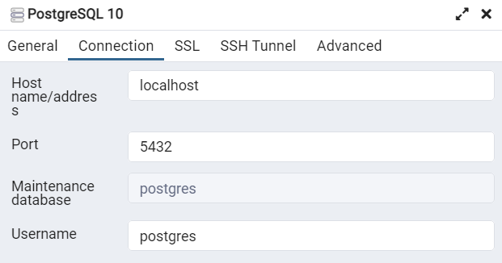

# Registro_Vendas
Esse diretório tem como objetivo estudar a conexão de banco de dados usando Python: O objetivo desse desenvolvimento é criar um Script onde prenchemos as informações solicitadas e ela preencha no Banco de Dados criado.

## Recursos

* Postgresql
* Biblioteca psycopg2

## Como foi feito? 

Inicialmente criamos um Data Base
```
CREATE DATABASE estudando
```

Criamos uma tabela para receber as informações
```
CREATE TABLE Vendas(
	id_venda int,
	cliente varchar(50),
	produto varchar(50),
	data_venda date,
	preco decimal(6, 2),
	quantidade int
)
```
<br/>

Dentro do nosso Banco pegamos algumas informações para fazer a conexão
<div align="center"></div>

<br/>

### Desenvolvimento
```
# Começamos importando a biblioteca
import psycopg2

# Fazemos a conexão com o Banco
conexao = psycopg2.connect(database = "estudando", host = "localhost", user = "postgres", password = "senha_fake", port = "5432")

# Pegamos as informações com o usuário
idVenda = int(input("Digite o id de Venda: "))
cliente = input("Digite o nome do cliente: ")
produto = input("Digite o nome do produto: ")
data_venda = input("Digite a data da venda: ")
preco = int(input("Digite o preco do produto: "))
quantidade = (input("Digite a quantidade: "))

# Criamos um cursor 
cur = conexao.cursor() 

# Executamos uma função sql apontando para o cursor criado
cur.execute("INSERT INTO Vendas (id_venda, cliente, produto, data_venda, preco, quantidade) VALUES (%s, %s, %s, %s, %s, %s)", (idVenda, cliente, produto, data_venda, preco, quantidade))

conexao.commit()

# Close communication with the database
cur.close()
conexao.close()
```
### Para que serve o Cursor 

O cursor é um objeto fornecido pela biblioteca psycopg2 que permite executar comandos SQL em um banco de dados PostgreSQL e recuperar os resultados dessas consultas. Ele age como um ponteiro móvel para as linhas retornadas pelo banco de dados.
